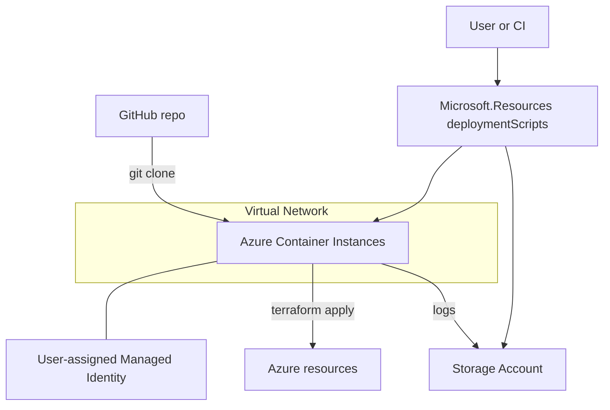

# Azure Deployment Script

Azure Deployment Script を使って、`terraform/` のインフラ構成をサンドボックス環境から自動で `terraform init/plan/apply` します。

## リポジトリ構成

```
azure-deployment-script/
├─ deploy/            # Deployment Script 実行用の Terraform
│  ├─ main.tf
│  ├─ variables.tf
│  └─ backend.tf
├─ terraform/         # デプロイ対象の Terraform 構成
│  ├─ main.tf
│  ├─ variables.tf
│  ├─ locals.tf
│  └─ backend.tf
└─ README.md
```

## 仕組み（概要）

`deploy/` の Terraform から `azapi_resource` で `Microsoft.Resources/deploymentScripts`（API 2023-08-01 など）を呼び出し、Azure Container Instances（コンテナ）内で次のスクリプトを実行します。

- Terraform のインストール
- このリポジトリをクローンして `terraform/` へ移動
- `terraform init -> plan -> apply` を順に実行
- 実行結果を JSON で保存（`$AZ_SCRIPTS_OUTPUT_PATH`）し、ログもストレージに出力



ポイント（公式仕様の要点）

- Deployment Script は「コンテナ（Azure Container Instances）」と「ストレージアカウント」を支援リソースとして使用します。
- ライフサイクル制御：`cleanupPreference`（Always/OnSuccess/OnExpiration）と `retentionInterval`（PT1H〜PT26H）。OnExpiration 時は保持期間経過後に支援リソース → スクリプト本体の順で削除されます。
- API 2023-08-01 以降、`containerSettings.subnetIds` によるプライベート VNet 内実行が可能です（必要なストレージ ネットワーク/ロール設定が別途必要）。
- スクリプトは Azure CLI または Azure PowerShell をサポート。本リポジトリでは Azure CLI を使用しています。

### 実行フロー

1. ユーザー割り当てマネージド ID を作成し、必要なロールを割り当て
2. Deployment Script 用の ストレージアカウントを作成し、VNet のサブネットからのみアクセス許可
3. Deployment Script（Azure CLI）を起動して Terraform を実行し、結果を保存

> 備考: サンプルではサブネット名 `snet-ci`、VNet 名 `vnet-<project>-<env>`、リソース グループ `rg-<project>-<env>` を前提にしています。

## 使い方（クイックスタート）

1. `deploy/terraform.tfvars` を自分の環境に合わせて編集
2. `deploy/` で `terraform init`
3. `deploy/` で `terraform apply`
4. 完了後、Azure Portal の Deployment Scripts リソース、または作成されたストレージのログを確認

> ヒント: スクリプトはこのリポジトリ（GitHub）をクローンして `terraform/` 配下を実行します。private リポジトリを使う場合は取得方法の調整（例: `git clone` に PAT を利用）を検討してください。

## 生成物とログ

- Deployment Script の標準出力は `$AZ_SCRIPTS_OUTPUT_PATH` に JSON で保存され、主に以下を含みます：

```json
{
  "terraformResults": {
    "subscriptionId": "<subscriptionId>",
    "terraformVersion": "<tf_version>",
    "initExitCode": 0,
    "planExitCode": 0,
    "applyExitCode": 0,
    "initOutputLines": ["..."],
    "planOutputLines": ["..."],
    "applyOutputLines": ["..."],
    "timestamp": "2025-01-01T12:34:56+09:00"
  }
}
```

- 併せて以下のログファイルも出力します：
  - `terraform-init.log`
  - `terraform-plan.log`
  - `terraform-apply.log`

## 参考資料

- [Azure Resource Manager テンプレートでデプロイ スクリプトを使用する](https://learn.microsoft.com/ja-jp/azure/azure-resource-manager/templates/deployment-script-template)
- [Microsoft.Resources deploymentScripts テンプレート リファレンス](https://learn.microsoft.com/ja-jp/azure/templates/microsoft.resources/deploymentscripts?pivots=deployment-language-terraform)
